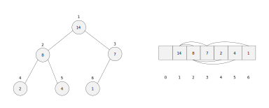

# 堆

**（二叉）堆**（Binary heap）是一种基于二叉树的数据结构。堆是一颗完全二叉树，也就是说，除了最底层外，其它层从左到右被节点完全填满，如果最底层不完整，则该层的节点尽可能靠左填充。而且树中每个节点的值都大于等于或小于等于其子节点的值。

堆分为**最大堆**和**最小堆**两种。最大堆中的每个节点的值都大于等于其子节点的值，因此，堆的最大节点是根节点，并且子树根节点的值都大于等于其子树所有节点的值；最小堆与最大堆相反，堆中每个节点的值都小于等于其子节点的值，因此，堆的最小节点是根节点，并且子树根节点的值都小于等于其子树所有节点的值。

## 堆的表示



堆通常用数组来表示。因为堆是一颗完全二叉树，所以存储在数组中更加紧凑，并且通过下标，我们可以很容易的计算得到父子节点的下标。

如果根节点存储在下标为 `1` 的位置上，那么下标为 i 的节点，其左子节点的下标为 `2i`，右子节点的下标为 `2i + 1`，而父节点的下标为 `i / 2`，叶子节点在 n / 2 + 1 ~ n 范围内。

``` js
getLeftIndex(i) {
  return 2 * i;
}
getRightIndex(i) {
  return 2 * i + 1;
}
getParentIndex(i) {
  return Math.floor(i / 2);
}
```

## 堆的操作

堆的操作主要包括插入元素、删除堆顶元素和获取堆顶元素。不过在讲解这些操作之前，我们先来了解堆化操作，因为堆的插入、删除和堆排序都是围绕它展开的。

### 堆化

**堆化**（heapify）用于由某些操作导致不满足堆性质（有序性）时，用于维护堆性质的重要过程，而这个过程包括自下而上和自上而下两种情况。

#### 自下而上（heapify-up）

自下而上堆化过程的思路是顺着某个节点所在路径向上比较。如果某个节点与它的父节点不满足堆性质，则交换它和它的父节点来维护堆性质。这个过程会不断重复，直到当前路径上的所有节点满足堆性质为止。

``` js
heapifyUp(index) {
  let pos = i || this.container.length - 1;
  while (pos > 1 && this.container[this.getParentIndex(pos)] < this.container[pos]) {
    this.swap(this.container, pos, this.getParentIndex(pos));
    pos = this.getParentIndex(pos);
  }
}
```

上述代码描述的是最大堆自下而上堆化的过程，如果当前节点不是根节点且大于父节点的值，则交换父子节点的值；否则退出程序。

而最小堆则是在当前节点小于它的父节点时才进行交换操作。

#### 自上而下（heapify-down）

自上而下堆化过程的思路是从根节点开始向下比较。如果某个节点与它的子节点不满足堆性质，则交换不满足堆性质的父子节点来维护堆性质。这个过程会不断重复，直到满足堆性质或到达叶子节点为止。

``` js
heapifyDown(i = 1) {
  while (2 * i <= this.size) {
    let pos = i;
    const left = this.getLeftIndex(i);
    const right = this.getRightIndex(i);
    if (left <= this.size && this.container[i] < this.container[left]) pos = left;
    if (right <= this.size && this.container[pos] < this.container[right]) pos = right;
    if (pos === i) break;
    this.swap(this.container, i, pos);
    i = pos;
  }
}
```

上述代码描述的是最大堆自上而下堆化的过程，在这个过程中从当前节点和它的子节点中选出最大节点，并将下标存储在 `pos` 中。如果当前节点是最大的，则以该节点为根的子树是最大堆，跳出循环；如果最大元素是某个子节点，则交换父子节点的值，使父子节点满足最大堆的性质。交换后以 `pos` 为根的子树可能不满足最大堆的性质，因此需要循环进一步堆化。

而最小堆则是在当前节点和它的子节点中选出最小节点，然后根据具体情况来看是否需要交换。

堆化的时间复杂度与树的高度成正比，因此为 O(logn)。

### 插入元素

因为堆元素从下标为 1 的位置开始存储，所以我们首先需要增加堆的大小，然后将新元素插入到堆的末尾，最后将新元素通过自下而上堆化交换到合适位置。

``` js
insert(data) {
  this.container[++this.size] = data;
  this.heapifyUp(this.size);
}
```

插入元素的时间复杂度为 O(logn)。

### 删除堆顶元素

我们首先需要使用堆的最后一个元素来替换堆顶元素，然后减小堆的大小并将新的堆顶元素通过自上而下堆化交换到合适位置，最后返回删除后的堆顶元素。

``` js
remove() {
  if (this.isEmpty()) return;

  let val = this.peek();
  this.container[1] = this.container[this.size--];
  this.heapifyDown(1);
  return val;
}
```

删除堆顶元素的时间复杂度为 O(logn)。

### 获取堆顶元素

堆顶元素是堆的第一个元素，如果堆不为空，我们返回堆顶元素。

``` js
peek() {
  if (!this.isEmpty()) return this.container[1];
}
```

获取堆顶元素的时间复杂度为 O(1)。

### 其它操作

`isEmpty()` 用于判断堆是否为空。

``` js
isEmpty() {
  return this.size === 0;
}
```

## 堆排序

**堆排序**（Heapsort）是一种在堆数据结构中基于比较的排序算法。其思想是先将未排序数组建成一个堆，然后从堆中不断的提取堆顶元素到已排序数组中，直到堆为空为止。

我们可以通过堆排序将最大堆的数据从小到大（升序）排列，将最小堆的数据从大到小（降序）排列。


堆排序可以分为建堆和排序两个阶段。

### 建堆

建堆阶段有两种实现思路。

第一种思路（如上图）是从左到右将未排序数组元素插入到堆的末尾，然后利用自上而下堆化建堆。

第二种思路是从右到左利用自上而下堆化建堆。

后者的性能要优于前者。因为数组下标为 n / 2 + 1 ~ n 的元素是树的叶子节点，每个叶子节点可以看做大小为 1 的子堆，而这些叶子节点不需要堆化，一开始我们只需要扫描数组中的一半元素，也就是 n / 2 ~ 1 的元素，并对其进行堆化。这样比较和交换的次数少了之后性能就会得到提升。

第二种思路的实现如下：

``` js
build(a, n) {
  for (let i = Math.floor(n / 2); i >= 1; i--) {
    this.heapify(a, i, n);
  }
}
```

第一种思路的时间复杂度为 O(nlogn)，第二种思路的时间复杂度为 O(n)。

### 排序

排序阶段的思路是交换堆顶元素与堆的最后一个元素的值，并减小堆的大小，通过自上而下的堆化将新的堆顶元素的值移动到合适位置。不断重复这一过程，直到堆为空为止。

``` js
sort(a) {
  let n = a.length - 1;
  this.build(a, n);
  while (n > 1) {
    this.swap(a, 1, n--);
    this.heapify(a, 1, n);
  }
}
```

::: tip
建堆和排序阶段使用的 heapify 方法与 heapifyDown 方法的代码相同，只不过 heapify 将需要排序的数组作为堆，而不需要额外的空间。
:::

因为建堆阶段的时间复杂度为 O(n)，排序阶段的时间复杂度为 O(nlogn)，所以堆排序总的时间复杂度为 O(nlogn)，关键在于最坏情况时间复杂度也为 O(nlogn)。

堆排序是原地排序算法。因为建堆和排序都是在原数组中进行，所以空间复杂度为 O(1)。

堆排序是不稳定排序算法。因为在排序过程中会改变值相同元素的先后顺序。

堆排序适合在内存受限的环境中使用，因为不需要额外空间。不过在堆化过程中很少比较相邻的数组元素，因此无法利用 CPU 缓存加速访问数组元素。

关于堆的详细代码，请点击[这里](https://github.com/ZhangGuangZe/data-structures-and-algorithms-in-javascript/blob/master/heap/Heap.js)查看。

## 应用场景

除了堆排序外，堆还应用于以下场景：

- 优先队列
- 图算法
- 求 TOP K
- 求中位数

## 参考

- [Wikipedia](https://en.wikipedia.org/wiki/Heap_(data_structure))
- 《算法导论》
- 《算法》（第4版）
- 《数据结构与算法之美》
- 《学习JavaScript数据结构与算法》（第3版）
- [javascript-algorithms](https://github.com/trekhleb/javascript-algorithms)