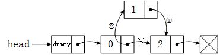
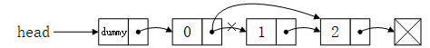
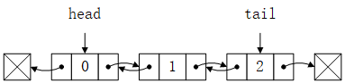
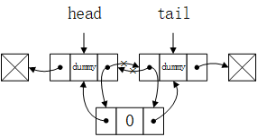
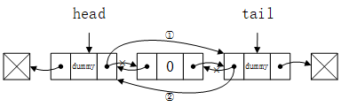

# 链表

**链表**（Linked List）是一种通过**指针**(或引用)将**节点**（零散内存块）串联起来的线性表数据结构。链表的 `head` 属性指向链表的第一个节点，如果 `head` 指向 null，则为空链表。

数组的线性顺序由**下标**决定，而链表的线性顺序由**指针**决定。

链表的优点是插入和删除节点的操作动态高效，缺点则是每个节点的指针都需要额外存储空间，而且访问节点元素的时间复杂度是线性的。

链表有很多种类型，包括单向链表、双向链表、循环链表等。

可以通过**哨兵**来简化处理空链表边界条件的处理，从而简化链表代码。接下来将介绍单向链表和双向链表两种链表的原理及使用哨兵优化的实现。

## 单向链表

单向链表的每个节点由**数据元素**（data）和**后继指针**（next）指针组成。链表的 `head` 属性指向第一个节点为**头**（head）节点，节点后继指针指向 null 的节点为**尾**（tail）节点。


### 单向链表结构

单向链表的节点结构。

``` js
class Node {
  constructor(data, next = null) {
    this.data = data;
    this.next = next;
  }
}
```

单向链表的结构包括一个作为指向头节点引用的 `head` 属性，以及一个用于记录链表节点总数 `size` 属性。

``` js
class LinkedList {
  constructor() {
    this.head = new Node('dummy');
    this.size = 0;
  }
}
```

### 查找操作

``` js
find(data) {
  let curr = this.head.next;
  let i = 0;
  while (curr) {
    if (curr.data === data) return i;
    curr = curr.next;
    i++;
  }
  return -1;
}
```

查找操作的最好情况时间复杂度为 O(1)，最坏情况时间复杂度为 O(n)，平均情况时间复杂度为 O(<del>2/</del>n)。

### 插入操作

单向链表的**插入**操作包括：
  - 从链表链表头部插入节点；
  - 从链表尾部插入节点；
  - 从任意位置插入节点。



单向链表插入操作的思路是先将插入节点的 next 指针指向当前节点的后继节点，然后再将当前节点的 next 指针指向插入节点。

由于插入操作的逻辑存在 code redundancy，所以可以将从链表头部和尾部插入节点操作直接 delegate 到任意位置插入节点操作中。

1. 从链表头部插入节点

``` js
prepend(data) {
  this.insert(0, data);
}
```

2. 从链表尾部插入节点

``` js
append(data) {
  this.insert(this.size, data);
}
```

3. 任意位置插入节点

``` js{8-9}
insert(index, data) {
  if (index < 0 || index > this.size) return false;
  const node = new Node(data);
  let curr = this.head;
  while (index-- > 0) {
    curr = curr.next;
  }
  node.next = curr.next;
  curr.next = node;
  this.size++;
  return true;
}
```

单向链表从链表头部插入节点操作的时间复杂度为 O(1)，从链表尾部和任意位置插入节点操作由于需要遍历链表节点，所以时间复杂度为 O(n)。

遍历操作如下：

``` js
get(index) {
  if (index < 0 || index >= this.size) return -1;
  let curr = this.head;
  while (index-- >= 0) {
    curr = curr.next;
  }
  return curr.data;
}
```

### 删除操作

单向链表的**删除**操作包括：

  - 删除链表头节点；
  - 删除链表尾节点；
  - 删除任意位置节点；
  - 删除值等于指定值的节点。



单向链表删除节点的思路是先找到删除节点的前驱节点，然后将前驱节点的 next 指针指向删除节点的后继节点。

与插入操作同理，我们也可以将删除链表头节点和尾节点的操作 delegate 到删除任意位置节点操作中。

1. 删除链表头节点

``` js
removeHead() {
  this.remove(0);
}
```

2. 删除链表尾节点

``` js
removeTail() {
  this.remove(this.size - 1);
}
```

3. 删除任意位置节点

``` js {7}
remove(index) {
  if (index < 0 || index >= this.size) return false;
  let curr = this.head;
  while (index-- > 0) {
    curr = curr.next;
  }
  curr.next = curr.next.next;
  this.size--;
  return true;
}
```

4. 删除值等于指定值的节点

``` js {6}
removeVal(data) {
  let isDeleted = false;
  let curr = this.head;
  while (curr.next) {
    if (curr.next.data === data) {
      curr.next = curr.next.next;
      this.size--;
      isDeleted = true;
    } else {
      curr = curr.next;
    }
  }
  return isDeleted;
}
```

删除链表头节点操作的时间复杂度为 O(1)，而删除链表尾部节点、删除任意位置节点和删除值等于指定值的节点操作由于需要遍历链表节点，所以时间复杂度为 O(n)。

单向链表在指定节点前插入和删除指定节点的操作并不容易实现，需要 O(n) 的时间复杂度，那么有没有其他链表数据结构能简单高效在 O(1) 的时间复杂度内实现以上操作呢？

## 双向链表

双向链表的每个节点由**数据元素**（data）、**前驱指针**（prev）和**后继指针**（next）构成。如果节点的 prev 指针为 null，则该节点为双向链表的头节点、如果节点的 next 指针为 null，则该节点为双向链表的尾节点。



### 双向链表结构

双向链表的节点结构。

``` js
class Node {
  constructor(data, prev = null, next = null) {
    this.data = data;
    this.prev = prev;
    this.next = next;
  }
}
```

双向链表的链表结构由指向头节点的 `head`、指向尾节点的 `tail` 和记录双向链表节点数量的 `size` 属性组成。我们为双向链表的头尾节点增加两个哨兵节点，并让这两个哨兵节点首尾相连。

``` js
class DoublyLinkedList {
  constructor() {
    this.head = new Node('dummyHead');
    this.tail = new Node('dummyTail');
    this.head.next = this.tail;
    this.tail.prev = this.head;
    this.size = 0;
  }
}
```

### 查找操作

``` js
get(index) {
  if (index < 0 || index >= this.size) return -1;
  let curr = this.head;
  if (index + 1 < this.size - index) {
    for (let i = 0; i < index + 1; i++) {
      curr = curr.next;
    }
  } else {
    curr = this.tail;
    for (let i = 0; i < this.size - index; i++) {
      curr = curr.prev;
    }
  }
  return curr;
}
```

尽管链表查找的时间复杂度为 O(n)，不过在双向链表中，我们可以根据节点所在位置决定双向链表遍历方向，如果查找节点所在位置小于双向链表一半的长度，则从双向链表头部开始遍历后继节点，否则从双向链表尾部开始遍历前驱节点，最终返回当前位置所在节点。这样，我们可以将双向链表查找操作的时间复杂度优化到 O(n<del>/2</del>)。

### 插入操作

双向链表的插入操作主要包括：

  - 从双向链表头部、尾部和任意位置插入节点；
  - 在指定节点前插入节点。

双向链表插入操作的思路是首先将插入节点的 prev 和 next 指针指向它的前驱节点和后继节点，然后将后继节点的 prev 指针指向插入节点，最后将插入节点 prev 指针指向前驱结点。



1. 从双向链表头部插入节点

``` js
prepend(data) {
  this.insert(0, data);
}
```

2. 从双向链表尾部插入节点

``` js
append(data) {
  this.insert(this.size, data);
}
```

3. 任意位置插入节点

``` js {27-30}
insert(index, data) {
  if (index < 0 || index > this.size) return false;
  let precursor;
  let successor;
  if (index === 0) {
    precursor = this.head;
    successor = this.head.next;
  } else if (index === this.size) {
    precursor = this.tail.prev;
    successor = this.tail;
  } else {
    if (index < this.size - index) {
      precursor = this.head;
      for (let i = 0; i < index; i++) {
        precursor = precursor.next;
      }
      successor = precursor.next;
    } else {
      successor = this.tail;
      for (let i = 0; i < this.size - index; i++) {
        successor = successor.prev;
      }
      precursor = successor.prev;
    }
  }
  const node = new Node(data);
  node.next = successor;
  precursor.next = node;
  successor.prev = node;
  node.prev = precursor;
  this.size++;
  return true;
}
```

双向链表从头部和尾部插入的时间复杂度为 O(1)，因为它们可以直接使用头节点和尾节点进行插入操作。而在任意位置插入节点操作由于需要找到插入位置而遍历节点所以时间复杂度为 O(n)，同样可以根据双向链表查找操作的思路优化遍历时间。

- 在指定节点前插入节点

``` js {2-5}
insertBefore(node1, node2) {
  node2.prev = node1.prev;
  node2.next = node1;
  node1.prev.next = node2;
  node1.prev = node2;
  this.size++;
  return true;
}
```

由于事先知道插入节点的前驱节点，所以在指定节点前插入节点的时间复杂度为 O(1)。

### 删除操作

双向链表的删除操作主要包括：

  - 删除链表头节点；
  - 删除链表尾节点；
  - 删除指定节点。

双向链表删除操作的思路是将删除节点前驱节点的 next 指针指向删除节点的后继节点，然后将删除节点后继节点的 prev 指针指向删除节点的前驱节点。



1. 删除链表头节点

``` js
removeHead() {
  this.remove(this.head.next);
}
```

2. 删除链表尾节点

``` js
removeTail() {
  this.remove(this.tail.prev)
}
```

3. 删除指定节点

``` js {3-4}
remove(node) {
  if (this.size === 0) return false;
  node.prev.next = node.next;
  node.next.prev = node.prev;
  this.size--;
  return true;
}
```

在双向链表的删除操作中，删除链表头节点、尾节点和指定节点的时间复杂度为 O(1)。

双向链表除了以上插入和删除操作外，在指定值前/后插入节点或者删除值等于指定值的节点时，由于在插入和删除之前需要遍历链表，所以需要 O(n) 的时间复杂度。

## 应用场景

- LRU 缓存淘汰算法

LRU（Least Recently Used，最近最少使用）缓存淘汰算法。

原理是访问数据时：

- 如果该数据不存在于缓存中：
  - 如果缓存未满，则将该数据插入到缓存头部；
  - 如果缓存已满，则将删除缓存末尾数据，然后将该数据插入到缓存头部；
- 如果该数据存在于缓存中，则将数据从原始位置挪动到缓存头部。

可以使用双向链表或者哈希表实现该算法。

## 参考

- [Wikipedia](https://en.wikipedia.org/wiki/Linked_list)
- [javascript-algorithms](https://github.com/trekhleb/javascript-algorithms)
- 《算法导论》
- 《算法》（第4版）
- 《数据结构与算法之美》
- 《学习JavaScript数据结构与算法》（第3版）