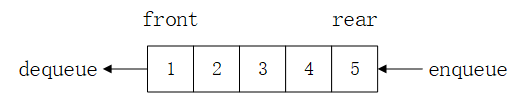
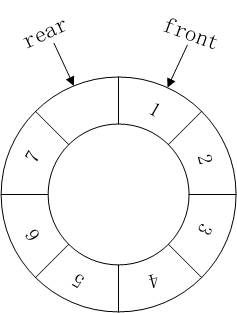

# 队列

**队列**（Queue）是一种**先进先出**（FIFO, First-In-First-Out）的线性表数据结构或者抽象数据类型。类似于排队买票，只允许从**队尾**（rear 或 tail）排队等待，从**队头**（front 或 head）取票。

队列主要包括**入队**（enqueue）和**出队**（dequeue）操作，这两个操作的时间复杂度为 O(1)。



队列可以基于数组和链表实现。

## 基于数组实现队列

以下是使用定容数组实现的队列：

``` js
class ArrayBasedQueue {
  constructor(capacity) {
    this.items = new Array(capacity);
    this.size = capacity;
    this.front = 0;
    this.rear = 0;
  }

  enqueue(val) {
    if (this.isFull()) return;
    this.items[this.rear++] = val;
  }

  dequeue() {
    if (this.isEmpty()) return;
    return this.items[this.front++];
  }
}
```

基于定容数组实现的队列入队和出队需要考虑溢出和下溢情况。入队时将数据插入到 `rear` 指针指向的位置，并将 `rear` 指针向右移动一位；出队时也是将 `front` 指针向右移动一位。

如果 `rear` 指针移动到数组最右侧，即便队列还有空间或者队列为空也无法插入数据。这就需要通过数据搬移来利用剩余空间，这将导致入队操作的时间复杂度为 O(n)。

## 基于链表实现队列

也可以基于单向链表或双向链表实现队列，以下是使用单向链表实现的队列，节点结构请参考单向链表节点结构。

``` js
class LinkedListBasedQueue {
  constructor(capacity) {
    this.head = null;
    this.tail = null;
    this.size = 0;
    this.capacity = capacity;
  }

  enqueue(val) {
    if (this.isFull()) return;

    const newNode = new Node(val);
    if (this.isEmpty()) {
      this.head = newNode;
      this.tail = newNode;
    } else {
      this.tail.next = newNode;
      this.tail = this.tail.next;
    }
    this.size++;
  }

  dequeue() {
    if (this.isEmpty()) return; //  throw new Error('queue underflow!');

    const val = this.head.val;
    this.head = this.head.next;
    if (!this.head) this.tail = null;
    this.size--;
    return val;
  }
}
```

使用单向链表的思路是在原链表的基础上添加一个指向尾节点的 `tail` 指针即可，入队操作通过 `tail` 指针在链表尾部添加元素，出队操作则是将链表头节点指向其后继节点即可，出队需考虑下溢情况。

## 循环队列



由于基于定容数组实现的队列在 `rear` 指针移动到数组最右边时需要搬移数据，这导致入队操作的时间复杂度为 O(n)，可使用取余运算模拟循环队列在避免数据搬移的情况下提高剩余存储空间的利用率，将入队操作的时间复杂度优化到 O(1)。

1. 基于数组实现循环队列

``` js
class ArrayCircularQueue {
  constructor(capacity = 5) {
    this.items = new Array(capacity + 1);
    this.size = capacity + 1;
    this.front = 0;
    this.rear = 0;
  }

  get length() {
    return (this.rear - this.front + this.size) % this.size;
  }

  enqueue(val) {
    if (this.isFull()) return;
    this.items[this.rear] = val;
    this.rear = (this.rear + 1) % this.size;
  }

  dequeue() {
    if (this.isEmpty()) return;
    const val = this.items[this.front];
    this.front = (this.front + 1) % this.size;
    return val;
  }

  isEmpty() {
    return this.front === this.rear;
  }

  isFull() {
    return this.front === (this.rear + 1) % this.size;
  }
}
```

基于数组实现的循环队列会浪费一个储存空间来处理队列为空和队满的条件。

2. 基于链表实现循环队列

以下是基于单向链表实现的循环队列，创建节点请参考单向链表节点结构。

``` js
class LinkedListCircularQueue {
  constructor(capacity = 5) {
    this.capacity = capacity;
    this.size = 0;
    this.head = null;
    this.tail = null;
  }

  enqueue(val) {
    if (this.isFull()) return;

    const newNode = new Node(val);
    if (this.isEmpty()) {
      this.head = newNode;
    } else {
      this.tail.next = newNode;
    }
    this.tail = newNode;
    this.tail.next = this.head; // 保持循环
    this.size++;
  }

  dequeue() {
    if (this.isEmpty()) return;

    const val = this.head.val;
    this.head = this.head.next;
    this.size--;

    return val;
  }
}
```

入队操作需要将新节点的 `next` 指针指向头节点，出队操作只需删除头节点即可。

## 双端队列

双端队列可以在两端进行入队和出队操作。

以下是基于双向链表实现的双端队列，创建节点请参考双向链表节点结构。

``` js
class DoublyEndedQueue {
  constructor() {
    this.head = null;
    this.tail = null;
    this.size = 0;
  }

  push(val) {
    const newNode = new Node(val);
    if (this.isEmpty()) {
      this.head = newNode;
      this.tail = newNode;
    } else {
      this.tail.next = newNode;
      newNode.prev = this.tail;
      this.tail = newNode;
    }
    this.size++;
  }

  unshift(val) {
    const newNode = new Node(val);
    if (this.isEmpty()) {
      this.head = newNode;
      this.tail = newNode;
    } else {
      newNode.next = this.head;
      this.head.prev = newNode;
      this.head = this.head.prev;
    }
    this.size++;
  }

  pop() {
    if (this.isEmpty()) return;
  
    const val = this.tail.val;
    if (this.head === this.tail) { // 链表只有一个节点
      this.head = null;
      this.tail = null;
    } else {
      this.tail = this.tail.prev;
      this.tail.next = null;
    }
    this.size--;
    return val;
  }

  shift() {
    if (this.isEmpty()) return;
  
    const val = this.head.val;
    if (this.head === this.tail) { // 链表只有一个节点
      this.head = null;
      this.tail = null;
    } else {
      this.head = this.head.next;
      this.head.prev = null;
    }
    this.size--;
    return val;
  }
}
```

关于队列所有实现的详细代码和测试请点击[这里](https://github.com/ZhangGuangZe/data-structures-and-algorithms-in-javascript/tree/master/queue)查看。

## 应用场景

- 浏览器任务队列
- 广度优先搜索

## 参考

- [Wikipedia](https://en.wikipedia.org/wiki/Queue_(abstract_data_type))
- [javascript-algorithms](https://github.com/trekhleb/javascript-algorithms)
- 《算法导论》
- 《算法》（第4版）
- 《数据结构与算法之美》
- 《学习JavaScript数据结构与算法》（第3版）