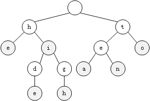

# Trie 树

**Trie 树**，也称**字典树**或**前缀树**。它是一棵 N 叉树，一种用于高效的存储和查找字符串数据集中键的树形结构。

Trie 树的根节点不包含任何数据，其他每个节点只包含字符串的的一个字符。从根节点到终止字符路径上的字符连接起来表示一个字符串。

Trie 树借助空间换时间的思想，利用字符串的公共前缀，将重复的前缀合并到一条路径上，节省了内存开销并且提高了查询的效率。

## Trie 树的表示



Trie 树通常使用数组来表示。节点的 `data` 属性用于表示当前字符；`children` 属性用于表示子节点，这里使用小写字母字符集，所以使用大小为 26 的数组储存子节点（将 a 字符储存到下标为 0 的位置，依次类推）；`isWord` 属性用于表示当前字符是否是一个完整的单词。

``` js
class TrieNode {
  constructor(data) {
    this.data = data;
    this.children = new Array(26);
    this.isWord = false;
  }
}
```

## Trie 树的操作

Tire 树主要包括插入和查找字符串两个操作。

### 插入操作

Trie 树的插入操作从根节点开始，从左到右依次遍历字符串中的每一个字符；如果当前字符不是当前节点的子节点，则创建一个新节点作为当前节点的子节点，否则将当前节点指向子节点；字符串遍历完成后，将最后一个节点的 `isWord` 属性置为 `true`。

``` js
insert(word) {
  let node = this.root;

  for (let i = 0; i < word.length; i++) {
    const index = word[i].charCodeAt() - 'a'.charCodeAt();
    if (!node.children[index]) {
      const newNode = new TrieNode(word[i]);
      node.children[index] = newNode;
    }
    node = node.children[index];
  }

  node.isWord = true;
}
```

Trie 树的插入操作时间复杂度为 O(n)，n 为插入字符串的长度。

### 查找操作

Trie 树的查找操作从根节点开始，从左到右遍历字符串，如果当前节点不是父节点的子节点，则返回 `false`；遍历完成后，如果当前字符串是一个完整的单词则返回 `true`，否则返回 `false`。

``` js
search(word) {
  let node = this.root;

  for (let i = 0; i < word.length; i++) {
    const index = word[i].charCodeAt() - 'a'.charCodeAt();
    if (!node.children[index]) return false;
    node = node.children[index];
  }

  return node.isWord;
}
```

Trie 树的查找操作时间复杂度为 O(n)，n 为查找字符串的长度。

关于 Trie 树的详细代码请点击[这里](https://github.com/ZhangGuangZe/data-structures-and-algorithms-in-javascript/blob/master/trie/trie.js)查看。操作的可视化效果请点击[这里](https://www.cs.usfca.edu/~galles/visualization/Trie.html)查看。

## 性能分析

以上实现的 Trie 树只支持小写字母字符集，如果需要支持更多字符，需要扩展 `children` 数组，不过这样会占用更多内存，我们可以将数组换成散列表和红黑树等高效数据结构来节省内存消耗。

## 应用场景

- 搜索引擎关键字提示
- 单词拼写检查

## 参考

- [Wikipedia](https://en.wikipedia.org/wiki/Trie)
- [字典树](https://baike.baidu.com/item/%E5%AD%97%E5%85%B8%E6%A0%91)
- [JavaScript Algorithms and Data Structures](https://github.com/trekhleb/javascript-algorithms/tree/master/src/data-structures/trie)
- 《数据结构与算法之美》
- [LeetCode](https://leetcode.cn/tag/trie/problemset/)