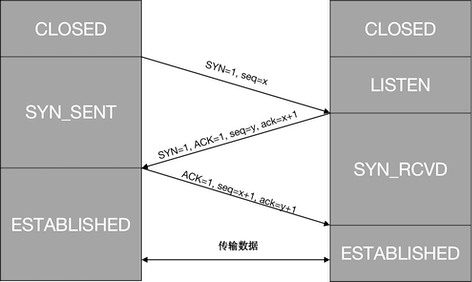
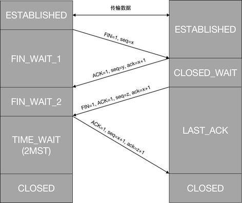

# TCP 协议

TCP（Transmission Control Protocol），即传输控制协议。是一个**面向连接**的、**可靠**的、**基于字节流**的通信协议。

## 首部结构

- 源端口号

发送的应用程序。

- 目的端口号

接收的应用程序。

- 序列号

为每个数据包编号，用于解决乱序问题。

- 确认序号

确认发出去的包是否已经收到，用于解决丢包问题。

- 状态位

  - SYN 创建连接
  - ACK 回复
  - RST 重新连接
  - FIN 断开连接

- 窗口大小

指定发送方当前愿意接收的字节数量。用于流量控制和拥塞控制。

- 校验和

用于检测错误。

## 连接过程

TCP 连接分为建立连接、传输数据和断开连接三个阶段。

### 建立连接

在建立连接之前，客户端与服务端都处于 CLOSED 状态。服务端必须侦听（被动打开）来自客户端的连接请求，客户端使用三次握手主动建立连接，三次握手的过程需要客户端和服务端发送三个包来确认连接的建立。

1. SYN

客户端主动向服务端发送一个 SYN 包，包的序列号设置为随机数 x。然后进入 SYN_SENT 状态；

2. SYN-ACK

作为响应，服务端回复一个 SYN-ACK 包，包的确认号设置为收到的序列号 x+1，序列号设置为另一个随机数 y。然后进入 SYN_RCVD 状态；

3. ACK

客户端收到服务端发送的响应后，向服务端发送一个 ACK 包，包的序列号设置为收到的确认号 x+1，确认号设置为收到的序列号 y+1。然后进入 ESTABLISHED 状态，服务端收到 ACK 后，进入 ESTABLISHED 状态。

三次握手不仅可以确保客户端和服务端连接的建立，防止对方一直等待占用网络资源；还可以确认初始序列号（第 1 步和第 2 步确认了客户端的序列号，第 2 步和第 3 步确认了服务端的序列号），避免服务端收到失效的请求产生错误。

### 传输数据

在传输数据过程中，由于复杂的网络环境导致丢包、乱序和拥塞等情况时常发生，需要通过一些算法来保证传输的可靠性。

为了保证不丢包，客户端发送的数据包有一个序列号，服务端响应的确认包有一个确认号，服务端成功收到包后会返回一个 ACK 确认包。

为了保证不乱序，客户端和服务端通过缓存的方式保存包。客户端缓存里的包会按照序列号排序，并根据处理情况分为发送已确认、发送未确认、未发送可发送、未发送不可发送四个部分。服务端根据接收的数据重新排序，并根据处理情况分为接收已确认、待接收未确认和不能接收三个部分。

#### 重传机制

当出现乱序和丢包问题时，需要使用重发机制保证数据的完整性。

1. 超时重传

客户端对每一个发送但没有确认包设置一个定时器，如果超出一定时间仍未收到确认包，客户端将重传这个数据包。如果重传定时器被触发仍未收到确认包，定时器的值会被设置为上一次定时的两倍。

2. 快速重传

如果某一序列号的包丢失，服务端将不会确认高于该序列号的数据包，而是重复发送丢失包的上一个序列号的确认包，当客户端收到三次重复的确认包后，就重传最后一个未被确认的数据包。

3. 选择确认

服务端在接收到一定的数据包后才进行发送确认包。

#### 流量控制机制

流量控制用来避免客户端发送数据的速度太快导致服务端无法可靠的接收和处理数据。

TCP 使用滑动窗口来实现流量控制。服务端的接收窗口用来指定能够接收的最大数据量，客户端最多只能发送接收窗口允许的数量。当客户端收到服务端接收窗口为 0 的响应时，客户端会停止发送数据包并定时发送窗口探测包，期望服务端回复一个带有新的接收窗口大小的确认包。当接收窗口太小时，应该避免发送接收窗口小的响应，直到足够大时才响应。

#### 拥塞控制机制

拥塞控制用来避免客户端发送数据的数据太快导致网络拥塞，在不阻塞，不丢包的情况下充分利用带宽。

TCP 使用拥塞窗口并配合慢启动、拥塞避免、快速重传和快速恢复四种算法来实现拥塞控制。

1. 慢启动

一开始窗口大小设置为一个数据包，一次只能发送一个，收到确认包后，发送数量逐渐呈指数级增长，到达一定阈值需要降低增长速度。

2. 拥塞控制

当收到所有确认包后窗口数量在原来的基础上加一，发送数量开始线性增长。

3. 快速重传

网络开始拥塞，出现丢包情况，使用快速重传算法防止丢包。

4. 快速恢复

收到三次重复的确认包后，将窗口大小减半继续线性增长。

### 断开连接

在断开连接之前，客户端和服务端都处于 ESTABLISHED 状态。客户端主动关闭连接，服务端被动关闭连接。断开连接使用四次挥手来保证双方都能断开连接。

1. FIN

客户端主动向服务端发送一个断开连接的 FIN 请求包。客户端进入 FIN_WAIT_1 状态。

2. ACK

服务端收到客户端的 FIN 包后，向客户端回复一个 ACK 确认包。服务端进入 CLOSE_WAIT 状态，客户端不再向服务端发送数据，不过服务端仍可以向客户端发送数据。客户端收到确认后进入 FIN_WAIT_2 状态。

3. FIN

服务端的所有数据发送完毕后，向客户端发送一个断开连接的 FIN 请求包。服务端进入 LAST_ACK 状态，等待客户端确认。

4. ACK

客户端收到服务端的 FIN 包后，向服务端回复一个 ACK 确认包。客户端进入 TIME_WAIT 状态，客户端需要等待 2MST（Maximum Segment Lifetime，报文最大生存时间），客户端可以重新向服务端发送 FIN 确认包，防止服务端没有收到客户端发的 ACK 确认包，最终进入 CLOSED 状态。而服务端收到 ACK 确认包后，最终也进入 CLOSED 状态。

四次握手不仅可以确保双方断开连接，还可以防止由于网络延迟导致的对方收到失效请求而导致的错误。

## 参考

- [Wikipedia](https://en.wikipedia.org/wiki/Transmission_Control_Protocol)
- [趣谈网络协议](https://time.geekbang.com/column/article/8975)
- [浏览器工作原理与实践](https://time.geekbang.com/column/article/113550)