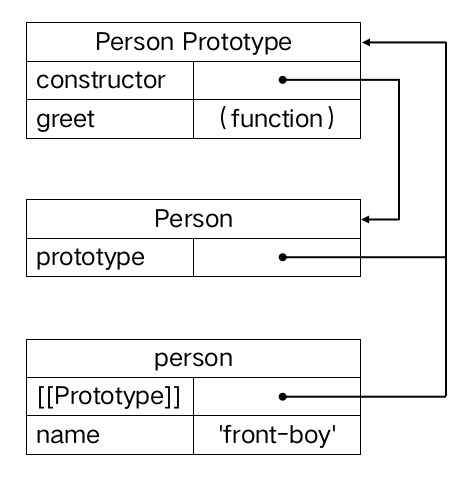

# 面向对象编程

## 对象

对象是一系列属性的动态无序集合，每个属性都由键和值构成。键可以是字符串或 Symbol，值可以是任意类型的值。

### 创建对象

我们可以通过对象字面量、`new` 关键字组合构造函数和 `Object.create()` 方法创建对象。后两种方式将会在 [JavaScript 面向对象的演进](#javascript-面向对象的演进)中讲解。

#### 对象字面量

对象字面量是描述对象初始化的表达式，它是由大括号包裹的零个、一个或多个以逗号分隔的键值对构成的**属性列表**，键是标识符、字符串字面量、数值字面量，值是任意表达式。最后一个属性的逗号是可选的。

``` js
let o1 = {};
let o2 = {
  a: 1,
  'b': 2,
  7: 3, // 可选逗号
};
```

ES6 为对象字面量提供了一些简洁方便的语法特性。

##### 简写属性

如果键和值与定义的变量名相同，使用简写属性可以省略冒号和键值，避免代码冗余。

``` js
let a = 'foo';
let o1 = { a: a };
let o2 = { a };
```

##### 简写方法

通过简写方法省略冒号和后面的函数定义表达式，可以让方法定义更加简洁清晰。

``` js
let o1 = {
  foo: function () {}
};
let o2 = {
  foo() {}
};
```

通过在方法前面加上 getter 和 setter 修饰符可以在查询和设置属性时调用相关函数。

``` js
const person = {
  firstName: 'Michael',
  lastName: 'Jordan',
  get fullName() {
    return this.firstName + ' ' + this.lastName;
  },
  set fullName(val) {
    [this.firstName, this.lastName] = val.split(' ');
  }
};
```

##### 计算属性

计算属性受到动态访问属性的启发，允许使用 `[]` 包裹表达式，动态计算出键名。`[]` 除了可以包裹表达式外，还可以包裹不合法的标识符、任意字符串或 Symbol。

``` js
let mySymbol = Symbol('mySymbol');
const o = {
  ['foo' + 1]: 'bar',
  ['hello world']: 1,
  [mySymbol]: 'hello world'
};
```

### 访问属性

我们可以通过点号表示法和方括号表示法来访问对象属性。点号表示法用于访问键名必须是合法标识符的属性；方括号表示法用于访问的键名是非法标识符或通过表达式动态计算的属性，键名必须是字符串和 Symbol，表达式求出的非字符串都会被转换为字符串。如果访问的属性不存在则返回 `undefined`。

``` js
o.foo1;           // => 'bar'
o['hello world']; // => 1
o[mySymbol];      // => 'hello world'
o.bar;            // => undefined
```

### 创建和设置属性

我们可以通过 `=` 操作符为对象属性赋值，如果属性不存在，则会创建一个新属性，如果属性存在，则会重新设置该属性的值。

``` js
const o = {};
o.foo = 'bar';
o.foo = 'baz';
```

### 删除属性

我们可以通过 `delete` 操作符删除对象的**自有属性**。如果删除成功则返回 `true`，如果删除无意义的操作数也会返回 `true`，表示什么也不做。

``` js
const o = { a: 1 };
delete o.a; // => true 成功删除属性
delete o.b; // => true 删除不存在的属性（无意义）
delete 0;   // => true 删除的不是对象属性（无意义）
```

如果删除不可配置属性则会返回 `false`，通过变量声明或函数声明创建的全局对象的属性也是不可配置属性。

``` js
// 删除对象不可配置属性
const o = {};
Object.defineProperty(o, 'a', { configurable: false });
delete o.a;       // => false

// 删除全局对象不可配置属性
var b = 1;
delete b;         // => false

function f() {}
delete f;         // => false

delete undefined; // => false
```

在严格模式下，如果删除的是不可配置的属性，则会导致 `TypeError`；如果删除的是非限定标识符（变量、函数名称和函数参数），则会导致 `SyntaxError`，操作数必须使用属性访问表达式才能避免语法错误。

``` js
'use strict';
const o = {};
Object.defineProperty(o, 'a', { configurable: false });
delete o.a; // => TypeError

let b = 1;
delete b; // => SyntaxErr

function f() {}
delete f; // => SyntaxErr

delete globalThis.name //  => true
```

::: tip
`Object.defineProperty()` 方法用于定义属性特性，在元编程章节中将会深入讲解。
:::

### 检查属性

- in 操作符

我们可以通过 `in` 操作符检查指定对象是否拥有**自有属性**或**继承属性**。

``` js
const o = {
  foo: 1
};
'foo' in o;      // => true
'bar' in o;      // => false
'toString' in o; // => true
```

- hasOwnProperty(prop)

`hasOwnProperty()` 方法用于检查指定对象是否拥自有属性。

``` js
const o = {
  foo: 1
};
o.hasOwnProperty('foo');      // => true
o.hasOwnProperty('toString'); // => false
```

由于该方法缺乏保护机制，如果在对象上拥有同名属性会有被覆盖风险。

``` js
const o = {
  foo: 1,
  hasOwnProperty: false
};
o.hasOwnProperty('foo'); // TypeError
```

不过，可以通过一种安全的方式检查自有属性。

``` js
Object.prototype.hasOwnProperty.call(o, 'foo');
```

- Object.hasOwn(obj, prop)<sup>(ES2022)</sup>

ES2022 增加了 `Object.hasOwn()` 方法来替代 `hasOwnProperty()` 方法。这让检查指定对象是否拥有某个自有属性变得更加直观。

``` js
const o = {
  foo: 1,
  hasOwnProperty: false
};
Object.hasOwn(o, 'foo');            // => true
Object.hasOwn(o, 'hasOwnProperty'); // => true
Object.hasOwn(o, 'toString');       // => false
```

### 枚举属性

- Object.keys(obj)<sup>(ES6)</sup>

`Object.keys()` 方法返回指定对象所有可枚举的、以字符串作为键名的自有属性键名数组。

- Object.getOwnPropertyNames(obj)

`Object.getOwnPropertyNames()` 方法返回指定对象所有可枚举和不可枚举的、以字符串作为键名的自有属性键名数组。

- Object.getOwnPropertySymbols(obj)<sup>(ES6)</sup>

`Object.getOwnPropertySymbols()` 方法返回指定对象所有可枚举和不可枚举的、以 Symbol 作为键名的自有属性键名数组。

- Reflect.ownKeys(obj)<sup>(ES6)</sup>

`Reflect.ownKeys()` 方法返回指定对象所有可枚举和不可枚举的、以字符串和 Symbol 作为键名的自有属性键名数组。

``` js
const enumerableSymbolKey = Symbol('enumerableSymbolKey');
const nonEnumSymbolKey = Symbol('nonEnumSymbolKey');
const o = {
  enumerableStringKey: 1,
  [enumerableSymbolKey]: 2
};
Object.defineProperties(o, {
  nonEnumStringKey: {
    value: 3,
    enumerable: false
  },
  [nonEnumSymbolKey]: {
    value: 4,
    enumerable: false
  }
});
Object.keys(o);                   // => ['enumerableStringKey']
Object.getOwnPropertyNames(o);    // => ['enumerableStringKey', 'nonEnumStringKey']
Object.getOwnPropertySymbols(o);  // => [Symbol(enumerableSymbolKey), Symbol(nonEnumSymbolKey)]
Reflect.ownKeys(o);               // => ['enumerableStringKey', 'nonEnumStringKey', Symbol(enumerableSymbolKey), Symbol(nonEnumSymbolKey)]
```
- Object.values(obj)<sup>(ES2017)</sup>

`Object.values()` 方法返回指定对象的所有可枚举的、以字符串作为键名的自有属性键值数组。

- Object.entries(obj)<sup>(ES2017)</sup>

`Object.entries()` 方法返回指定对象的所有可枚举的、以字符串作为键名的自有属性键值对数组。

``` js
const symbolKey = Symbol('symbolKey');
const o = {
  stringKey: 1,
  [symbolKey]: 2
}
Object.values(o);  // => [1]
Object.entries(o); // => [['stringKey', 1]]
```

- Object.fromEntries(iterable)<sup>(ES2019)</sup>

`Object.fromEntries()` 方法用于将一个可迭代的键值对列表转换为一个对象。

``` js
Object.fromEntries([['a', 1], ['b', 2]]); // => {a: 1, b: 2}
```

#### 枚举顺序

对象的自有属性始终按以下顺序列出：

1. 以整数为字符串键名的属性（按数字升序）；

2. 其它字符串键名的属性（按添加先后顺序）；

3. 以 Symbol 为键名的属性（按添加先后顺序）。

``` js
const symbol1 = Symbol('symbol1');
const symbol2 = Symbol('symbol2');
const o = {[symbol1]: 0, b: 0, '-1': 0, 2: 0, '1': 0, '-2': 0, 'str': 0, a: 0, [symbol2]: 0 };
Reflect.ownKeys(o); // =>  ['1', '2', 'b', '-1', '-2', 'str', 'a', Symbol(symbol1), Symbol(symbol2)]
```

### 复制对象

复制对象包括浅拷贝和深拷贝两种方式。两种方式的区别在于：如果键值是一个对象，浅拷贝只会复制对象的引用，而深拷贝则会复制对象的值。

#### 浅拷贝

- Object.assign(target, ...source)<sup>(ES6)</sup>

`Object.assign()` 方法将一个或多个源对象的所有可枚举的、以字符串和 Symbol 作为键的自有属性复制到目标对象，并返回目标对象。该方法不仅可以用来复制对象，还可以用来合并对象和为对象提供默认值。

``` js
// 复制对象
const source = { a: 1, b: 2 };
Object.assign(source); // => {a: 1, b: 2}

// 合并对象
const o1 = { a: 1 };
const o2 = { b: 2 };
Object.assign(o1, o2); // => {a: 1, b: 2}

// 为对象提供默认值
const o = { c: 3, a: 4 };
const defaults = { a: 1, b: 2 };
Object.assign({}, defaults, o); // => {a: 4, b: 2, c: 3}
```

- 扩展属性

在对象字面量中，ES2018 提供了一种更简洁的扩展属性语法做与 `Object.assign()` 方法相同的事。

``` js
// 复制对象
const source = { a: 1, b: 2 };
console.log({ ...source }); // => {a: 1, b: 2}

// 合并对象
const o1 = { a: 1 };
const o2 = { b: 2 };
console.log({ ...o1, ...o2 }); // => {a: 1, b: 2}

// 为对象提供默认值
const o = { c: 3, a: 4 };
const defaults = { a: 1, b: 2 };
console.log({ ...defaults, ...o }); // => {a: 4, b: 2, c: 3}
```

在合并对象过程中，如果对象存在同名属性，后面的属性会把前面的属性覆盖。

需要注意的是，`Object.assign()` 方法会调用源对象的 getter 方法和目标对象的 setter 方法。而展开属性语法只会调用 getter 方法。

``` js
const o1 = {
  set foo(val) {
    console.log('调用 setter 方法');
  }
};
const o2 = {
  get foo() {
    console.log('调用 getter 方法');
    return 'foo';
  }
};
console.log({...o1, ...o2}); // => 调用 getter 方法
Object.assign(o1, o2); 
// => 调用 getter 方法
// => 调用 setter 方法
```

#### 深拷贝

- JSON.parse(JSON.stringify(obj))

通过 JSON 序列化时，键值为 `undefined`、Symbol 或者为方法时会被忽略，如果对象中存在循环引用则会抛出 TypeError 异常。

- [structuredClone()](https://developer.mozilla.org/zh-CN/docs/Web/API/structuredClone) 方法可以实现深拷贝

如果对象中存在方法和 Symbol 值会抛出异常。

- [_.cloneDeep()](https://github.com/lodash/lodash/blob/master/cloneDeep.js)

针对以上两种方法存在的问题，可以通过 Lodash 库的 `_.cloneDeep()` 方法解决。

- 自己实现

可以通过递归自己实现一个深拷贝，不过这里并没有解决循环引用问题。

``` js
function cloneDeep(obj) {
  if (typeof obj !== 'object') return;
  let res = !Array.isArray(obj) ? {} : [];
  for (const [key, val] of Object.entries(obj)) {
    if (Object.hasOwn(obj, key)) {
      if (val != null && typeof val === 'object') {
        res[key] = cloneDeep(val);
      } else {
        res[key] = val;
      }
    }
  }
  return res;
}
const o = {
  a: 1,
  b: undefined,
  c() {},
  d: Symbol('symbolVal'),
  e: {
    f: null,
    g: [1, 2, 3]
  }
};
const copy = cloneDeep(o);
o === copy; // => false
```

## 面向对象编程概述

**面向对象编程**（Object-oriented programming，简称 OOP）是一种基于对象的编程范式。它将对象作为程序的基本单元，把数据和操作数据的方法封装在对象中，通过继承、组合或委托等机制来提高代码的可重用、可扩展和可维护性。

通过面向对象的方式，我们可以将现实世界中的所有事物抽象为对象。

对象具有**唯一标识性**、**状态**和**行为**三个特性，每个对象都有一块唯一标识的内存地址（修改一个对象的状态和行为并不会影响到另一个对象），都通过状态来表示对象，并通过行为来改变对象的状态。

在 Java 中，状态和行为通过属性和方法来描述；而在 JavaScript 中，状态和行为统一通过属性来描述，属性既可以用作数据存储，也可以将行为与对象关联。那些值为函数的属性，可以作为对象的方法调用。而作为对象方法调用的函数，则可以使用 `this` 关键字动态的访问对象。

面向对象编程有基于类（Class-based）和基于原型（Prototype-based）两种编程风格。

### 基于类

在基于类的编程风格中，类是主要实体，用于抽象代码。对象的状态和行为由类抽象，类是对象的蓝图和模板，对象必须通过类来创建，对象是类的实例。

基于类的面向对象常出现在静态语言中，例如 Java。

基于类的编程风格关注**实体与实体之间的关系**，先有类，类和类之间通过**继承**、**组合**等机制建立关联关系，再通过类来实例化对象。子类继承父类和通过类实例化对象本质上是一种**复制**。

#### 封装（Encapsulation）

封装是指将数据和操作数据的方法捆绑在一起，或者隐藏对象的内部结构限制用户直接访问，从而保护对象的完整性。在一些编程语言中，只允许通过方法访问或者通过关键字来限制访问。

#### 继承（Inheritance）

继承是将一个类基于另一个类的机制，从现有类（超类或基类）派生新类（子类），然后形成类的层次结构。子类通过继承获取父类的所有属性和行为，从而实现代码复用。

有些编程语言支持多继承，即一个子类拥有多个父类，例如 C++，而有些编程语言只支持单继承，即一个子类只能拥有一个父类，例如 Java，不过 Java 可以通过接口来实现多继承。

基于继承实现代码复用存在两个主要问题：

- 类与类之间存在高度耦合

对基类的修改会无意更改到子类的行为。不过，可以通过接口来避免该问题，因为接口只是抽象行为，并没有具体实现。

- 类层次结构的静态性质

意味着用户不能在运行时动态的扩展子类。不过，可以通过组合来在运行时动态的扩展子类。

#### 多态（Polymorphism）

多态是指子类继承父类时，子类对父类行为的特殊化处理。在编程语言中，多态包含函数重载和子类覆盖两种形式。

### 基于原型

在基于原型的编程风格中，对象是主要实体，甚至不存在类，对象直接定义自己的状态和行为。

基于原型的面向对象常出现在动态语言中，例如 JavaScript。

基于原型的编程风格只关注**对象之间的关联关系**，先关注对象的行为，然后才关心如何将对象划分到相似的原型对象。对象之间的关联本质上是一种**委托**机制。

#### 委托（Delegation）

委托是一种使对象从其他对象中获取部分或全部状态和行为的机制，对象与对象之间通过指针**串联**，从而实现行为共享。委托包含显示和隐式两种。显示委托在任何面向对象编程语言中都可以实现，隐式委托则需要语言支持成员访问规则的特性。

JavaScript 同时支持显示和隐式委托。当通过各种语法（例如成员访问、`for...in` 遍历和 `in` 操作符等）查找属性时，首先会在对象上查找是否有对应属性。如果有，则返回对象上的值；如果没有，则查找会顺着指针进入原型对象。然后在原型对象上查找对应属性。如果有，则返回原型对象上的值；如果没有则继续在原型的原型上查找。直到找到属性或者查找到原型的“尽头” `null` 为止。最后如果原型为空则返回 `undefined`。这一系列对象的链接称为**原型链**。

## JavaScript 面向对象的演进

### 早期的对象模型

在设计 Mocha 原型前，管理层决定这门辅助 Java 的浏览器脚本语言必须**看起来像 Java**，保持易用性并且**基于对象**，而不是像 Java 一样基于类。

出于对 Self 的认可和为了节省实现成本，Brendan Eich 选择带有**单个原型链接的委托机制**，来创建动态的对象模型。但由于时间关系该机制未能暴露在 Mocha 原型中。

JavaScript 1.0 通过构造函数创建对象，但不支持继承。构造函数像类一样可以声明数据属性和方法。不过，方法在每次实例化时都会重新创建一遍，而且这些方法是全局可见的函数。

``` js
function pGreet() {
  return 'Hi. My name is ' + this.name + '.';
}

function Person(name) {
  this.name = name;
  this.greet = pGreet;
}

var person = new Person('front-boy');
person.greet();
```

JavaScript 1.1 将原型继承（委托）机制暴露了出来。我们通过函数对象的 `prototype` 属性，将原型对象与函数对象关联起来。通过 `new` 操作符会克隆出继承自原型对象属性的实例。

``` js
function pGreet() {
  return 'Hi. My name is ' + this.name + '.';
}

function Person(name) {
  this.name = name;
}

Person.prototype.greet = pGreet;

var person = new Person('front-boy');
person.greet();
```

通过原型对象解决了方法在实例化时的重复创建问题，方法现在只需在原型对象上挂载一次。

由原型对象提供的属性称为**继承属性**，而直接在对象是定义的属性称为**自有属性**。在访问属性时，如果对象上有一个与原型对象同名的属性，那么自有属性会覆盖继承属性。



<div style="text-align: center;">图 JavaScript 对象模型</div>

JavaScript 1.2 增加了受 Python 启发的对象字面量。这为创建和初始化对象提供了简洁语法。

``` js
// JavaScript 1.0
var person = new Object;
person.name = 'front-boy';

// JavaScript 1.2
var person = { name: 'front-boy' };
```

JavaScript 1.2 为实例对象提供了 `__proto__` 属性来动态的访问和修改指向原型对象的指针（引用）。从而让程序动态构造任意深度的属性继承层次结构，并动态指定对象从何处继承属性。

有了 `__proto__` 属性，我们就可以用其模拟 `new` 操作符的行为。不过在此之前，我们先来看看 `new` 操作符调用构造函数的原理。

#### `new` 操作符调用构造函数的原理

1. 创建一个新对象；
2. 将新对象的原型指向构造函数的原型对象；
3. 将构造函数内部的 `this` 与新对象绑定，并执行构造函数初始化新对象；
4. 如果构造函数返回对象，则返回该对象；否则自动返回创建的新对象。

下面我们通过代码来模拟 `new` 操作符的行为。

``` js
function createObject(Constructor, ...args) {
  // 1.创建新对象
  const obj = {};
  // 2.将对象原型指向构造函数的原型对象
  obj.__proto__ = Constructor.prototype;
  // 3.将 this 与新对象绑定并执行构造函数初始化新对象
  const res = Constructor.apply(obj, args);
  // 4.返回对象
  return typeof res === 'object' ? res : obj;
}

function Person(name) {
  this.name = name;
}
Person.prototype.sayName = function() {
  return `My name is ${this.name}`;
}
const person = createObject(Person, 'front-boy');
console.log(person.sayName()); // My name is front-boy
```

### 模拟类的抽象模型

在 ES6 之前，JavaScript 只有对象而没有类。为了满足基于类的面向对象需求，JavaScript 提供了一些近似类的语法。例如，构造函数（类对象）、`this`、`new` 和 `instanceof` 等。

下面，我们通过 JavaScript 这些近似类的语法，来模拟基于类的面向对象。

#### 原型继承

原型继承是综合了构造函数模式和原型模式创建对象，并且基于原型实现继承的一种模式。

``` js
function Person(name) {
  this.name = name;
}
Person.prototype.describe = function() {
  return `Person named ${this.name}`;
};

function Employee(name, title) {
  Person.call(this, name); // 调用父类构造函数
  this.title = title;
}
Employee.prototype = new Person(); // 基于原型实现继承
Employee.prototype.describe = function() {
  // 调用父类方法
  const description = Person.prototype.describe.call(this);
  return `${description}（${this.title}）`;
};

const john = new Employee('John', 'CTO');
john.describe(); // => 'Person named John（CTO）'
```

从以上代码可以看出，子类（Employee）需要通过函数对象的 `call()` 方法借用父类（Person）的构造函数和方法实现多态效果，并且需要使用函数对象的 `prototype` 与 Person 的实例关联实现继承。

我们可以用 `instanceof` 操作符来检测实例的类型。不过，与 Java 不同的是，JavaScript 的 `instanceof` 存在动态语义——遍历实例的原型链，搜索构造函数的原型对象。

``` js
john instanceof Person; // => true
john instanceof Employee; // => true
```

#### 寄生继承

寄生继承是由 Douglas Crockford 首倡的一种模式。其核心思想是在父类的基础上通过工厂模式增强子类的行为。

``` js
function Person(name) {
  this.name = name;
}
Person.prototype.describe = function() {
  return `Person named ${this.name}`;
};

function Employee(name, title) {
  const employee = new Person(name);
  employee.title = title;
  employee.describe = function() {
    const description = Person.prototype.describe.call(this);
    return `${description}（${this.title}）`;
  };
  return employee;
}

const john = new Employee('John', 'CTO');
john.describe(); // => 'Person named John（CTO）'
```

通过模拟的继承存在一个问题，那就是实例的 `constructor` 属性（从原型对象继承而来，表示由谁构造）被意外的修改成了 Person，而不是 Employee。

``` js
// 续上例
john.constructor === Person; // => true 
```

为了修复这个问题，需要手动维护原型的 `constructor` 属性。

``` js {2}
// 续上例
Employee.prototype.constructor = Employee;
john.constructor === Employee; // => true 
```

### 基于原型的面向对象

虽然 JavaScript 可以通过一些手段来模拟类的行为，从而基于类实现面向对象。但 JavaScript 的面向对象的本质是基于原型的。

Douglas Crockford 将 `Object.create()` 方法引入到 ES5 中，让我们摆脱构造函数的束缚，通过原型委托来关联对象，从而实现基于原型的面向对象。

`Object.create()` 方法的原理大致如下：

``` js
if (typeof Object.create !== 'function') {
  Object.create = function(o) {
    function F() {}
    F.prototype = o;
    return new F();
  };
}
```

以上代码需要创建一个临时的构造函数，然后将构造函数的 `prototype` 属性与对象关联，最后返回与对象关联的新实例。

现在，我们抛开基于类的思维，看看 JavaScript 如何基于原型实现面向对象。

``` js
const Person = {
  setName(name) {
    this.name = name;
  },
  getName() {
    return `Person named ${this.name}`;
  }
};

const employee = Object.create(Person);
employee.setTitle = function (name, title) {
  this.setName(name);
  this.title = title;
};
employee.describe = function () {
  return `${this.getName()}（${this.title}）`;
};

const john = Object.create(employee);
john.setTitle('John', 'CTO');
john.describe(); // => 'Person named John（CTO）'
```

我们可以通过 `Object.getPrototypeOf()` 和 `Object.setPrototypeOf()` 方法获取和设置指定对象的原型。

``` js
// 续上例
Object.getPrototypeOf(john) === employee; // => true
const prototype = {};
Object.setPrototypeOf(john, prototype);
Object.getPrototypeOf(john) === prototype; // => true
```

::: tip
可以通过 `Object.create(null)` 创建一个没有原型的新对象。
:::

### 基于类的面向对象

JavaScript 从早期只有对象没有类；到 1996 年首次 TC39 会议提出在语言中添加类特性的提案；再到 ES4 对类特性的两次失败尝试，再到社区通过 ES5 的特性模拟类和实现继承；最终，ES6 统一了社区方案，根据现有的对象模型（构造函数、原型对象和实例对象三要素），新增了语法简单并且语义轻量的 max-min 类，并在 ES2022 中增加类字段完善了类特性。

虽然 JavaScript 有了一套基于类的面向对象系统，可以提供高完整性的对象和更好地封装代码，并且解决了模拟类存在的一些问题。但是 JavaScript 中的类与其他语言中的类不太一样，因为它基于原型继承（委托）机制，类与实例之间的关系基于原型继承，子类与父类之间的关系基于原型继承。

#### 定义类

有两种定义类的方式：类声明和类表达式。类表达式的名称是可选的，该名称只能在类体内部访问。

``` js
// 类声明
class Person { ... }

// 匿名类表达式
const Person = class { ... };
// 具名类表达式
const Person = class ClassName { ... };
```

虽然 ES6 的类基于函数构建，并且都是一等公民，但与函数声明不同，类声明不支持提升，并且类体中的代码默认处于严格模式。

#### 构造函数

通过类定义创建的实例必须由 `new` 操作符调用类中的构造函数完成。

``` js
class Person {
  constructor(name) {
    this.name = name
  }
}
const person = new Person('front-boy');
```

#### 实例成员

实例成员是实例对象的自有属性。

在 ES6 的类中，实例属性必须在构造函数中定义。

``` js
class Person {
  constructor(name) {
    this.name = name;
  }
}
```

ES2022 为实例增加了共有字段和私有字段。私有实例字段只能在类体中使用。私有实例字段使用 `#` 作为前缀。

``` js
class Person {
  name = '';
  #age = 0;
  constructor(name, age) {
    this.name = name;
    this.#age = age;
  }
}
```

::: tip
使用字段可以更明确的区分对象字面量。将字段定义到类体顶部可以提高代码的可读性。
:::

在私有实例字段未被标准化之前，社区通过以下四种方式实现私有实例属性。

##### 命名约定

第一种方式是在名称前面加下划线来使属性私有。

``` js
function Counter() {
  this._count = 0;
}
Object.keys(new Counter()); // => ['_count']
```

这种方式没有保护作用，并且名称可能会出现冲突。不过，它易于使用。

##### 闭包

第二种方式利用闭包的特点来模拟私有属性。

``` js
function Counter() {
  let count = 0;
}
Object.keys(new Counter()); // => []
```

##### Symbol

第三种方式利用 Symbol 唯一标识的特点来模拟私有属性。

``` js
const symbolKey = Symbol('count');
class Counter {
  constructor() {
    this[symbolKey] = 0;
  }
}
const counter = new Counter();
Object.keys(counter); // => []
Object.getOwnPropertySymbols(new Counter()); // => [Symbol(count)]
```

这种方法虽然避免了名称冲突，并且具有保护作用，但是可以通过 `Object.getOwnPropertySymbols()` 枚举。

##### WeakMap

第四方式利用 WeakMap 来模拟私有属性。

``` js
const _count = new WeakMap();
class Counter {
  constructor() {
    _count.set(this, 'count');
  }
}
Object.keys(new Counter()); // => []
```

WeakMap 还可以防止外部访问并且不会有命名冲突，但是使用比较复杂。

#### 原型成员

原型成员是定义在类中的方法，这些方法可以作为共有方法在实例间共享，也可以作为私有方法在类中使用。私有方法使用 `#` 作为前缀。

``` js
class MyClass {
  publicMethod() {
    return 'publicMethod';
  }
  #privateMethod() {
    return 'privateMethod';
  }
}
Reflect.ownKeys(MyClass.prototype); // => ['constructor', 'publicMethod']
```

#### 静态成员

静态成员是一组属于类的特性，使用 `static` 关键字作为前缀。除了 ES6 增加的静态方法外，其它静态成员特性都是 ES2022 增加的。

##### 静态共有成员

``` js
class MyClass {
  static staticPublicField = 'staticPublicField';
  static staticPublicMethod() {
    return this.staticPublicField;
  }
}
Reflect.ownKeys(MyClass); // => ['length', 'name', 'prototype', 'staticPublicMethod', 'staticPublicField']
```

##### 静态私有成员

静态私有成员使用 `#` 作为前缀。

``` js
class MyClass {
  static #staticPrivateField = 'staticPrivateField';
  static #staticPrivateMethod() {
    return MyClass.#staticPrivateField;
  }
  instanceMethod() {
    return MyClass.#staticPrivateField;
  }
}
new MyClass().instanceMethod(); // => 'staticPrivateField'
```

静态私有方法和字段只能在类中通过类访问。

##### 静态初始化块

静态初始化块是初始化类时运行的代码块。通过静态初始化块，我们可以将类相关的代码封装在类体中，还可以访问私有成员。

``` js
let getInstancePrivateField;
class MyClass {
  #instancePrivateField;
  constructor() {
    this.#instancePrivateField = 'instancePrivateField';
  }
  static #staticPrivateField;
  static {
    MyClass.#staticPrivateField = 'privateField'
    console.log(MyClass.#staticPrivateField);
    getInstancePrivateField = (instance) => instance.#instancePrivateField;
  }
}
// => 'privateField'
getInstancePrivateField(new MyClass()); // => 'instancePrivateField'
```

与对象字面量一样，原型方法和静态方法都支持 getter 和 setter 访问器、生成器方法、异步方法和异步生成器方法，还可以使用字符串、Symbol 和计算属性作为键。

##### 静态工厂

有时，我们需要使用静态工厂方法来实例化一个类。例如，通过静态工厂方法创建一个年龄随机的 Person 实例。

``` js
class Person {
  static create(name, age) {
    return new Person(name, Math.floor(Math.random() * 100));
  }
  constructor(name, age) {
    this.name = name;
    this.age = age;
  }
}
Person.create('front-boy');
```

::: tip
关于类字段的更多细节可以查看 hex 的[《关于JS的field提案的一个小思考》](https://zhuanlan.zhihu.com/p/47310567)和[《勉为其难再次喷一下 private fields》](https://zhuanlan.zhihu.com/p/150244331)文章。
:::

#### 继承

从 ES6 开始，我们可以通过 `extends` 关键字扩展现有类，并通过 `super` 关键字调用父类构造函数或者覆盖父类方法。

``` js
class Person {
  constructor(name) {
    this.name = name;
  }
  describe() {
    return `Person named ${this.name}`;
  }
}

class Employee extends Person {
  constructor(name, title) {
    super(name);
    this.title = title;
  }
  describe() {
    return `${super.describe()}（${this.title}）`;
  }
}
const john = new Employee('John', 'CTO');
john.describe(); // => 'Person named John（CTO）'
```

在子类的构造函数中，必须先调用父类的构造函数才能访问 `this` 关键字并初始化子类。

##### 抽象类

抽象类可以为子类提供抽象方法，但不能被实例化。虽然 JavaScript 没有正式的抽象类语法，但是我们可以通过现有语法来实现。

``` js
class Person {
  constructor() {
    if (new.target === Person) {
      throw new Error('Person cannot be instantiated');
    }
  }
  describe() {
    throw new Error('subclass must define describe()');
  }
}
class Employee extends Person {}
const person = new Person(); // => Uncaught Error: Person cannot be instantiated
const employee = new Employee();
employee.describe();         // => Uncaught Error: subclass must define describe()
```

我们使用 `new.target` 判断抽象类是否被实例化，如果是则报错。子类必须覆盖抽象类方法，否则也会报错。

##### 混入

JavaScript 中的类只支持单继承，不过可以通过混入来模拟多继承。

``` js
class SuperClass {}
const A = SuperClass => class extends SuperClass {
  foo() {
    console.log('foo');
  }
}
const B = SuperClass => class extends SuperClass {
  bar() {
    console.log('bar');
  }
}
const C = SuperClass => class extends SuperClass {
  baz() {
    console.log('baz');
  }
}
function mixin(BaseClass, ...Mixins) {
  return Mixins.reduce((prev, curr) => curr(prev), BaseClass);
}
class SubClass extends mixin(SuperClass, A, B, C) {}
const s = new SubClass();
s.foo();
s.bar();
s.baz();
```

##### 组合

组合优于继承是设计模式中的一个重要原则，它可以让代码变得更加灵活。

## this 关键字

由于当初设计时管理层要求这门语言长得像 Java，但没有类，想要支持面向对象又不能没有 `this` 关键字。并且深受 Scheme 函数一等公民的启发等因素。Brendan Eich 借鉴了 Java 中的 `this` 关键字，并引入到了 JavaScript 的函数中，用来表示函数作为**方法被调用时的上下文对象**。

但是因为 `this` 是在运行时动态绑定的，它的指向取决于**函数的调用方式**，所以相同的 `this` 值在不同场景下的语义可能不同。这也导致 `this` 指向出现了一些混乱，可能与预期不符。

在 JavaScript 中，`this` 关键字可以出现在对象方法、独立函数和事件处理器中并且具有相同的语义；而在大多数语言中，`this` 关键字只能出现在类中。这使其他语言的开发者学习 JavaScript 时产生混乱。不过，`this` 动态性可以让代码变得更加简洁并且易于复用。原型对象的方法在运行时可以通过 `this` 动态的确认上下文对象。

关于 `this` 的更多细节，我们将会在浏览器的执行过程中看到。

## 参考

- [Wikipedia](https://en.wikipedia.org/wiki/Object-oriented_programming)
- [MDN-JavaScript](https://developer.mozilla.org/zh-CN/docs/Web/JavaScript)
- [ECMAScript proposals](https://github.com/tc39/proposals)
- 《你不知道的 JavaScript》上卷
- 《JavaScript 高级程序设计》（第 4 版）
- 《JavaScript 权威指南》（原书第 7 版）
- 《JavaScript 悟道》
- [《JavaScript for impatient programmers (ES1–ES2022) 》](https://exploringjs.com/impatient-js/toc.html)
- 《JavaScript 编程精解》（原书第 3 版）
- 《深入理解 JavaScript 特性》
- [《JavaScript 二十年》](https://github.com/doodlewind/jshistory-cn)
- [重学前端](https://time.geekbang.org/column/article/78884)
- [How JavaScript Works](https://crockford.com/javascript)
- [JavaScript专题之深浅拷贝](https://github.com/mqyqingfeng/Blog/issues/32)
- [面试官：深拷贝浅拷贝的区别？如何实现一个深拷贝？](https://vue3js.cn/interview/JavaScript/copy.html)